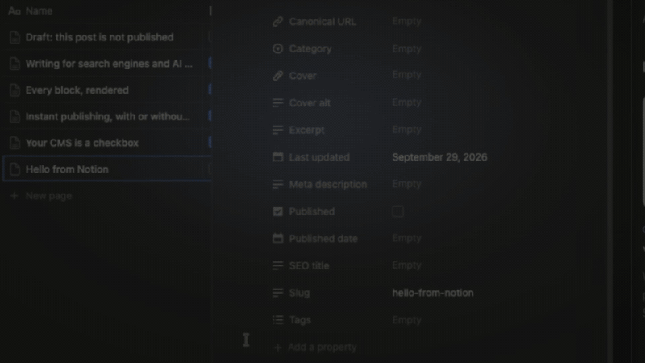

# Publish from Notion

**Your CMS is a checkbox.**

Write and edit in Notion. Keep your site’s design, URLs and hosting. This kit connects the two through the official Notion API, without making your database public.

[Live demo](https://publish-from-notion.vercel.app/blog) · [Get started](#get-started) · [Docs](docs/setup.md) · [Issues](https://github.com/loriscomba97/publish-from-notion/issues)

[](https://github.com/loriscomba97/publish-from-notion/actions/workflows/ci.yml)
[](LICENSE)



*39 seconds in this recording, on the Free Notion plan with connection webhooks. The wait is accelerated in the GIF; delivery times vary.*

## See it in action

Open [Every block, rendered](https://publish-from-notion.vercel.app/blog/every-block-rendered) to see an article with headings, lists, tables, toggles and images. Connect your own database to try publishing.

## Get started

Requires Git and Node.js 22.18 or later. Start with the local demo; you do not need a Notion account or token for this step.

```bash
git clone https://github.com/loriscomba97/publish-from-notion.git
cd publish-from-notion
npm ci
npm run dev
```

Open [localhost:3000](http://localhost:3000), choose **All posts**, and open an article. You should see built-in sample content, including a page demonstrating the supported blocks.

## Connect Notion

Create a database with `Name` (title), `Slug` (text) and `Published` (checkbox). Create a read-only internal connection in Notion and give it access to that database.

Copy `.env.example` to `.env.local`. Fill in `NOTION_TOKEN` and `NOTION_DATA_SOURCE`; keep the local `SITE_URL` for development. Restart the server. Add a page with a title, a slug such as `hello-from-notion`, some text and Published checked. Open `/blog/hello-from-notion` to read it on your site.

The [setup guide](docs/setup.md) covers every field, permissions and the optional database setup command. It also explains where to put secrets when deploying.

[](https://vercel.com/new/clone?repository-url=https%3A%2F%2Fgithub.com%2Floriscomba97%2Fpublish-from-notion&env=NOTION_TOKEN,NOTION_DATA_SOURCE&envDescription=The%20API%20token%20of%20your%20Notion%20connection%20and%20the%20link%20to%20your%20blog%20database&envLink=https%3A%2F%2Fgithub.com%2Floriscomba97%2Fpublish-from-notion%23connect-notion&project-name=notion-blog&repository-name=notion-blog)

## What it does

- **Use Notion as your editor.** The website selects published rows and renders their blocks as HTML. Your database can stay private, and the API token stays on the server.
- **Update without rebuilding.** Signed connection webhooks notify the website about page edits. The receiving route invalidates cached data so later requests can render the update.
- **Produce a complete blog.** Article pages include metadata and structured data. The template also generates a sitemap, RSS and a text index at `llms.txt`. Uploaded images are served through signed paths on your domain.

## Instant publishing

Connection webhooks work with the Free Notion plan tested during development. They arrive asynchronously, including for text edits. Paid plans can also use a database automation. Neither path promises a fixed delivery time.

Follow the [publishing guide](docs/publishing.md) to configure and verify one path. Without webhooks, the one-hour cache interval allows refreshes on subsequent requests; it is not an hourly background job.

## How it works

The TypeScript core reads the official API and converts blocks into HTML. Next.js caches that data. Page events invalidate the post list and the changed page; broader database events can invalidate more. The core has no runtime dependencies. The included template depends on Next.js and React.

## Add it to an existing Next.js site

Use the [integration guide](docs/existing-site.md) to copy the core, configuration, components and routes into an App Router project. The ready-to-run template targets Next.js 16; older versions need adaptation.

## What it does not do

This is a self-hosted public blog, not an access-controlled document portal. Unpublishing cannot erase downloaded content or cached images. Notion-hosted video, audio and PDFs are not rendered; equations appear as source text. Read the [rendering limits](docs/rendering.md) before migrating content.

Hosting and Notion remain external services. The kit makes no ranking promises and does not provide comments, search or an admin dashboard.

## Contribute and license

Bug reports with a reproducible example are useful. [CONTRIBUTING.md](CONTRIBUTING.md) explains development and tests; report security issues through [SECURITY.md](SECURITY.md).

[MIT](LICENSE) © 2026 Loris Comba. Not affiliated with Notion Labs, Inc.
